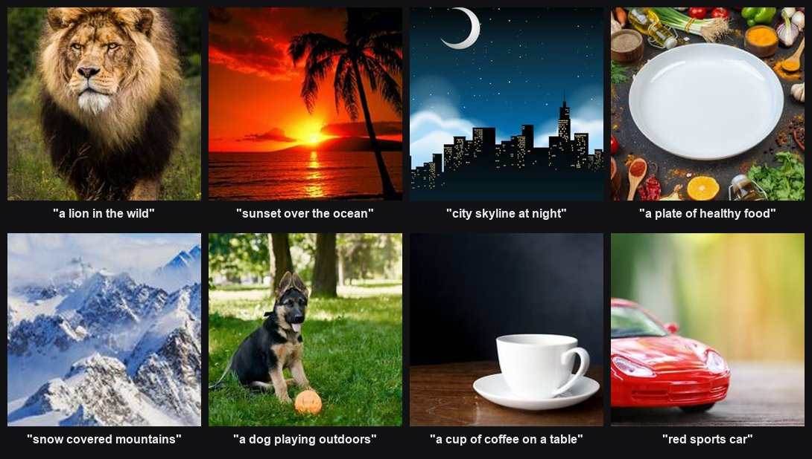
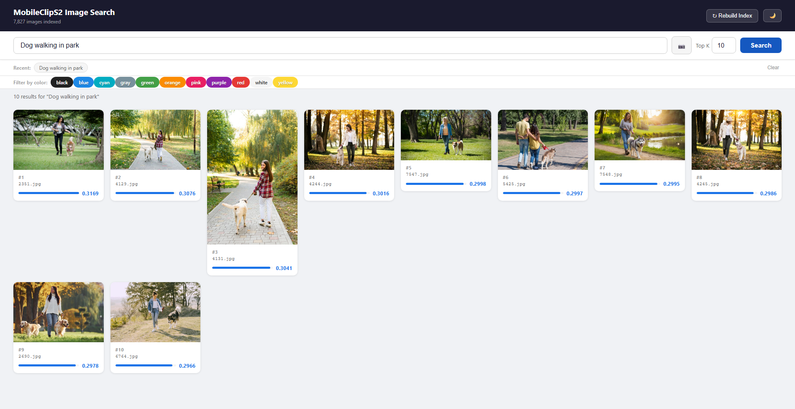
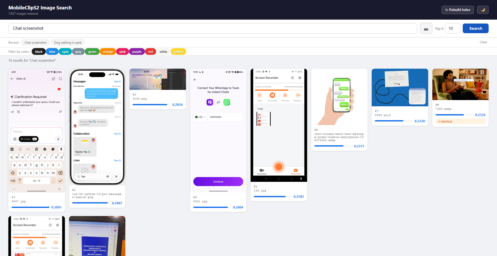

# 🔎 Semantic Image Search

A fast, fully-local **semantic image search** engine over a personal library of
~7,800 images. Search your photos with natural language ("a lion in the wild",
"sunset over the ocean"), find visually similar images, or drop in a photo to
search *by image* — all running on your own machine, no cloud, no API keys.

Images are embedded once with **Apple's official [MobileCLIP](https://github.com/apple/ml-mobileclip)**
— two switchable variants, **S2** and **S0**, both loaded at once. A Flask server
then encodes your text query (or an uploaded image) with whichever model is
selected and ranks the library by cosine similarity; a **Compare Models** view
lets you run the same query against every model side by side.



> *Top-1 result for eight different text queries, straight from the running app.
> See **[docs/RESULTS.md](docs/RESULTS.md)** for the full test report with scores.*

---

## ✨ Features

- **Natural-language search** — rank images by meaning, not filenames or tags.
- **Negative terms** — `beach -people` down-weights unwanted concepts.
- **Search by image** — drag-and-drop or upload a photo to find similar ones.
- **Find similar** — one click from any result to its nearest neighbours.
- **Colour filter** — narrow results to images containing a dominant colour.
- **Autocomplete** — prefix suggestions from a ~500-term vocabulary.
- **Recent searches**, **dark mode**, and a **lightbox** viewer (all in the UI).
- **Near-duplicate dedup** — pixel-identical images collapse into one hit with a
  `+N identical` badge.
- **Rebuild index** from the UI (incremental, streamed progress) when you add images.
- **Compare Models view** — toggle to a side-by-side layout that runs one query
  against every configured model at once (independent panels, add/remove as
  models are added), instead of switching the single dropdown back and forth.
- **100% local & offline** after the one-time model + image setup. No FAISS, no GPU
  required (runs on CPU); search is a plain NumPy matrix multiply.

---

## 🖥️ The web interface

The whole UI is a single page served at `http://127.0.0.1:5000` — a search bar
with autocomplete, recent-search chips, a colour-filter bar, dark-mode toggle,
and a responsive results grid where every card shows its rank, filename, and a
normalised relevance bar. Click any image for a lightbox with a **Find Similar**
button; drop an image on the bar to search by image.

**Text search — `"Dog walking in park"`:**



**Mixed content — `"Chat screenshot"`** (note the `+1 identical` dedup badge on the
last card, where a near-duplicate was collapsed):



---

## 🧠 How it works

```
                 build_index.py --model {s2,s0} (offline, once per model)
   images_repo/  ─────────────────────────────►  cache/embeddings.npz (s2)
   (7,800 imgs)      MobileCLIP-S2/S0 encode_image  cache/embeddings_s0.npz (s0)
                     + L2-normalise                 (N×512, L2-normalised)

                 app.py (serving, loads BOTH models at startup)
   "a red car"  ──► encode_text ──► 512-d vec ──►  dot product vs. every row
   + &model=s0/s2   (selected model)                of the selected model's
                                                     matrix ──► top-k ──► JSON + web UI
```

Because both images and text are embedded by the **same model** and
**L2-normalised**, cosine similarity is just a dot product. At ~7,800 images the
whole index is a small matrix, so a brute-force NumPy `matmul` is instant — no
vector database needed. Two model variants — **S2** and **S0** — are each
embedded into their own cache file and loaded simultaneously; a dropdown in the
UI switches which one answers a given request.

**Score range.** MobileCLIP text→image cosine similarities are *not* confidences
near 1.0 — good matches sit around **0.24–0.31**. Ranking order is what matters.
See [docs/RESULTS.md](docs/RESULTS.md).

---

## 📦 Prerequisites

| Requirement | Notes |
|-------------|-------|
| **Python 3.10+** | Developed on 3.12 (Windows 11). |
| **~2 GB RAM free** | For the model + index in memory. |
| **The image library** | Not in this repo (too large). Put your own images in `images_repo/`, named however you like. |
| **MobileCLIP checkpoints** | `mobileclip_s2.pt` (~380 MB) and, optionally, `mobileclip_s0.pt` (~215 MB), downloaded once each (see below). Not in this repo. |
| GPU | Optional. CPU works fine at this scale. |

> **What's *not* in this repo (by design):** the image library (`images_repo/`,
> multi-GB), the model checkpoint (`checkpoints/`, exceeds GitHub's 100 MB limit),
> and generated caches (`cache/`). These are listed in `.gitignore`. The steps
> below regenerate everything.

---

## 🚀 Getting started

### 1. Clone

```powershell
git clone https://github.com/Fahad-Durrani/semantic-image-search.git
cd semantic-image-search
```

To pull later updates:

```powershell
git pull
```

### 2. Get Apple's MobileCLIP package

The model is loaded via Apple's `mobileclip` package (this is important — an
earlier version used `open_clip`'s weights, which apply a *different* image
normalisation and were abandoned). Clone it next to the project and install it
editable:

```powershell
git clone https://github.com/apple/ml-mobileclip.git
pip install -e ./ml-mobileclip --no-deps
```

> `--no-deps` because torch / open_clip / timm are installed in the next step.
> The `ml-mobileclip/` folder must stay in place (editable install points at it).

### 3. Install Python dependencies

```powershell
pip install -r requirements.txt
```

### 4. Download the checkpoints

The app now loads **both** MobileCLIP variants at startup (so the model
dropdown can switch instantly, with no restart) — download both
**`mobileclip_s2.pt`** and **`mobileclip_s0.pt`** into a `checkpoints/` folder.
Both come from the same Apple CDN:

```powershell
mkdir checkpoints
# S2 -- from: https://docs-assets.developer.apple.com/ml-research/datasets/mobileclip/mobileclip_s2.pt
Invoke-WebRequest `
  -Uri "https://docs-assets.developer.apple.com/ml-research/datasets/mobileclip/mobileclip_s2.pt" `
  -OutFile "checkpoints/mobileclip_s2.pt"

# S0 -- from: https://docs-assets.developer.apple.com/ml-research/datasets/mobileclip/mobileclip_s0.pt
Invoke-WebRequest `
  -Uri "https://docs-assets.developer.apple.com/ml-research/datasets/mobileclip/mobileclip_s0.pt" `
  -OutFile "checkpoints/mobileclip_s0.pt"
```

> `app.py` will refuse to start if either checkpoint or its embedding cache is
> missing (see step 6). To make one variant truly optional, remove its entry
> from the `MODEL_CONFIGS` dict in both `app.py` and `build_index.py`.

### 5. Add your images

Put your image files in `images_repo/` (a flat folder). Supported extensions:
`.jpg .jpeg .png .webp .avif .jfif`. Any filenames work.

### 6. Build the embedding index (one time per model, ~10 min on CPU each)

```powershell
python build_index.py --model s2
python build_index.py --model s0
```

This writes `cache/embeddings.npz` (s2) / `cache/embeddings_s0.npz` (s0) and shows
a `tqdm` progress bar for each. Corrupt files are skipped automatically. Re-run
only when the contents of `images_repo/` change (or use the in-app **Rebuild
Index** button, which incrementally re-indexes new images for both models).

### 7. Run the app

```powershell
python app.py
```

Open **http://127.0.0.1:5000** in your browser. Both models load at startup;
use the **Model** dropdown next to Top K to switch between S2 and S0.

Quick smoke test from the terminal:

```powershell
Invoke-RestMethod -Uri "http://127.0.0.1:5000/search?q=lion&k=3&model=s2"
Invoke-RestMethod -Uri "http://127.0.0.1:5000/search?q=lion&k=3&model=s0"
```

---

## 🌐 API reference

The server exposes a small JSON/HTTP API (default host `127.0.0.1:5000`):

| Method & path | Purpose | Key params |
|---------------|---------|------------|
| `GET /` | The single-page web UI | — |
| `GET /search` | Text search | `q` (query, supports `-negative` terms), `k` (1–50, default 10), `color`, `model` (`s2`\|`s0`, default `s2`) |
| `GET /similar` | Nearest neighbours of an indexed image | `img` (filename), `k`, `model` |
| `POST /search_by_image` | Search by an uploaded image | multipart `image` file, `k`, `model` |
| `GET /suggest` | Autocomplete | `q` (prefix ≥2 chars), `limit`, `model` |
| `GET /models` | List available models (for the dropdown / compare panels) | — |
| `GET /colors` | List available colour-filter names | — (model-agnostic) |
| `POST /rebuild` | Start an incremental re-index (both models) | — |
| `GET /rebuild_stream` | Server-sent-events progress for a rebuild | — |
| `GET /images/<filename>` | Serve an image from `images_repo/` | — |

**Example — text search with a negative term, S0 model:**

```powershell
Invoke-RestMethod -Uri "http://127.0.0.1:5000/search?q=beach -people&k=5&model=s0"
```

Response shape:

```json
{
  "query": "lion", "positive": "lion", "negatives": [], "k": 3, "model": "s2",
  "results": [
    { "rank": 1, "filename": "4582.jpg", "score": 0.2951,
      "url": "/images/4582.jpg", "duplicate_count": 0 }
  ]
}
```

---

## 🗂️ Project layout

```
semantic-image-search/
├── app.py              # Flask server + embedded single-page frontend; loads both models
├── build_index.py      # Offline indexer → cache/embeddings.npz (--model s2|s0)
├── copy_images.py      # Helper: flatten nested folders into one dir
├── rename_folder.py    # Helper: rename a folder's images to 1..N
├── requirements.txt
├── CLAUDE.md           # Detailed architecture notes / gotchas
├── docs/
│   ├── demo.jpg        # README hero montage
│   ├── RESULTS.md      # Model test report (real outputs)
│   └── examples/       # Thumbnails of the test results
│
│   # ---- generated / provided locally, not in git ----
├── images_repo/        # Your image library
├── checkpoints/        # mobileclip_s2.pt, mobileclip_s0.pt
├── cache/              # embeddings.npz + suggestions.json (s2), embeddings_s0.npz + suggestions_s0.json (s0),
│                       # colors.json, skip_list.json (shared)
└── ml-mobileclip/      # Apple's package (cloned, installed editable)
```

Paths are hard-coded in `app.py` and `build_index.py` — both define a
`MODEL_CONFIGS` dict mapping `"s2"`/`"s0"` to their checkpoint/cache paths; keep
these two dicts in sync if you move things or add another variant. See
**[CLAUDE.md](CLAUDE.md)** for architecture details and the "things that will
bite you" list (e.g. `model.eval()` is mandatory — MobileCLIP has batchnorm).

---

## 🧪 Test results

A set of eight diverse text queries was run against the live index; the actual
top-4 results (with cosine scores) are documented in **[docs/RESULTS.md](docs/RESULTS.md)**.
Summary of top-1 scores:

| Query | Top-1 score |
|-------|:-----------:|
| a lion in the wild | 0.298 |
| city skyline at night | 0.308 |
| red sports car | 0.287 |
| a cup of coffee on a table | 0.283 |
| snow covered mountains | 0.288 |
| a dog playing outdoors | 0.272 |
| sunset over the ocean | 0.257 |
| a plate of healthy food | 0.257 |

---

## 🛠️ Troubleshooting

- **`Checkpoint not found for MobileCLIP-S2/S0`** — you skipped step 4 for that variant.
- **`No module named 'mobileclip'`** — run step 2 (`pip install -e ./ml-mobileclip --no-deps`).
- **`Cache not found for MobileCLIP-S2/S0`** — run `python build_index.py --model s2` / `--model s0` (step 6).
- **Weird / low-quality results** — make sure you're using Apple's `mobileclip`
  package, *not* `open_clip`; they normalise images differently.
- **Port 5000 in use** — change the port in the last line of `app.py`
  (`app.run(host="127.0.0.1", port=5000)`).

---

## 📄 Notes & credits

- Model: **[Apple MobileCLIP](https://github.com/apple/ml-mobileclip)** (MobileCLIP-S2 and MobileCLIP-S0). Checkpoints © Apple, under Apple's licence.
- This project is a personal / educational local search tool. The image library and
  the model checkpoint are **not** distributed here.
