# Model Test Results

These are **real, unedited outputs** from the running app (`GET /search`) against the local image library of ~7,800 images. Each query was encoded with **Apple MobileCLIP-S2** and ranked by cosine similarity against the pre-computed image embeddings. The images below are downscaled thumbnails (longest edge 320 px) of the actual top-4 hits; filenames refer to files in `images_repo/`.

> **About the scores.** MobileCLIP text→image cosine similarities are *not* absolute confidences. For this model, good matches typically land in the **~0.24–0.31** range, not near 1.0. What matters is the *ranking* (higher = more relevant for that query), not the raw magnitude. The app's UI normalises the result-bar width to the top hit's score.

All queries below used `k=4`. Reproduce any of them with, e.g.:

```powershell
Invoke-RestMethod -Uri "http://127.0.0.1:5000/search?q=a lion in the wild&k=4"
```

---

## Summary

| Query | Top-1 score | Top-4 score | Result files |
|-------|:-----------:|:-----------:|--------------|
| `a lion in the wild` | 0.298 | 0.293 | 5879.jpg, 5126.jpg, 1981.jpg, 3790.jpg |
| `sunset over the ocean` | 0.257 | 0.248 | 3611.jpg, 4469.jpg, 6076.jpg, 2344.jpg |
| `city skyline at night` | 0.308 | 0.266 | 2854.jpg, 7357.jpg, 5389.jpg, 5493.jpg |
| `a plate of healthy food` | 0.257 | 0.242 | 2610.jpg, 3119.jpg, 5779.jpg, 5562.jpg |
| `snow covered mountains` | 0.288 | 0.265 | 4743.jpg, 6607.jpg, 5738.webp, 237.jpg |
| `a dog playing outdoors` | 0.272 | 0.266 | 6056.jpg, 3022.jpg, 3491.jpg, 4221.jpg |
| `a cup of coffee on a table` | 0.283 | 0.267 | 2996.jpg, 7420.jpg, 3089.jpg, 3090.jpg |
| `red sports car` | 0.287 | 0.281 | 6185.jpg, 6149.jpg, 3951.jpg, 6180.jpg |

---

## a lion in the wild

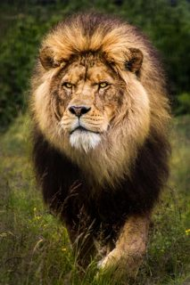 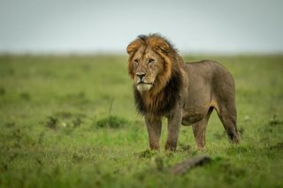 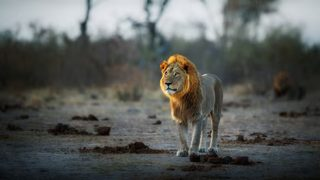 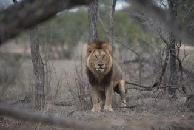

| Rank | File | Cosine score | Notes |
|:----:|------|:------------:|-------|
| 1 | `5879.jpg` | 0.2982 |  |
| 2 | `5126.jpg` | 0.2946 |  |
| 3 | `1981.jpg` | 0.2939 |  |
| 4 | `3790.jpg` | 0.2930 |  |

## sunset over the ocean

  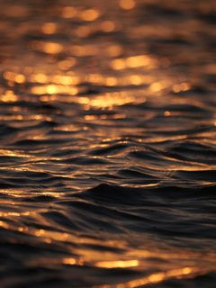 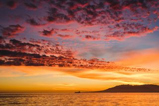

| Rank | File | Cosine score | Notes |
|:----:|------|:------------:|-------|
| 1 | `3611.jpg` | 0.2573 |  |
| 2 | `4469.jpg` | 0.2536 | +1 near-identical collapsed |
| 3 | `6076.jpg` | 0.2499 |  |
| 4 | `2344.jpg` | 0.2485 |  |

## city skyline at night

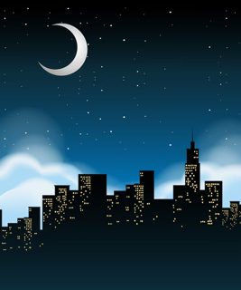   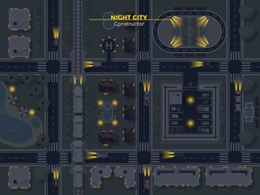

| Rank | File | Cosine score | Notes |
|:----:|------|:------------:|-------|
| 1 | `2854.jpg` | 0.3077 |  |
| 2 | `7357.jpg` | 0.2842 | +1 near-identical collapsed |
| 3 | `5389.jpg` | 0.2756 |  |
| 4 | `5493.jpg` | 0.2659 |  |

## a plate of healthy food

 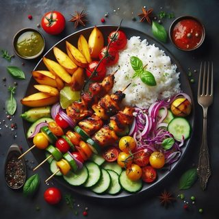 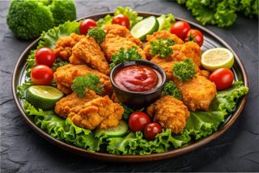 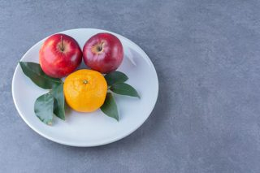

| Rank | File | Cosine score | Notes |
|:----:|------|:------------:|-------|
| 1 | `2610.jpg` | 0.2570 |  |
| 2 | `3119.jpg` | 0.2483 |  |
| 3 | `5779.jpg` | 0.2444 |  |
| 4 | `5562.jpg` | 0.2420 |  |

## snow covered mountains

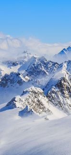 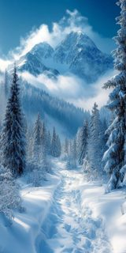 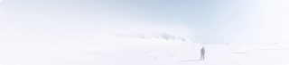 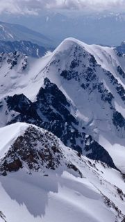

| Rank | File | Cosine score | Notes |
|:----:|------|:------------:|-------|
| 1 | `4743.jpg` | 0.2877 |  |
| 2 | `6607.jpg` | 0.2770 |  |
| 3 | `5738.webp` | 0.2664 |  |
| 4 | `237.jpg` | 0.2647 |  |

## a dog playing outdoors

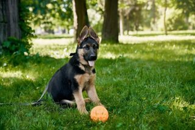 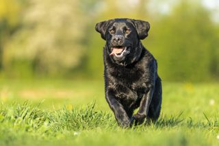 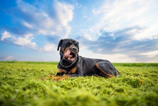 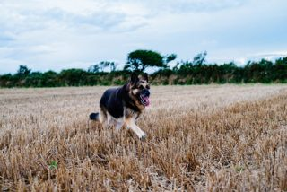

| Rank | File | Cosine score | Notes |
|:----:|------|:------------:|-------|
| 1 | `6056.jpg` | 0.2723 |  |
| 2 | `3022.jpg` | 0.2719 |  |
| 3 | `3491.jpg` | 0.2697 |  |
| 4 | `4221.jpg` | 0.2658 |  |

## a cup of coffee on a table

   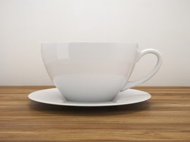

| Rank | File | Cosine score | Notes |
|:----:|------|:------------:|-------|
| 1 | `2996.jpg` | 0.2834 |  |
| 2 | `7420.jpg` | 0.2759 |  |
| 3 | `3089.jpg` | 0.2758 |  |
| 4 | `3090.jpg` | 0.2671 |  |

## red sports car

 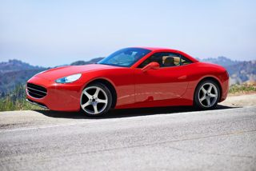 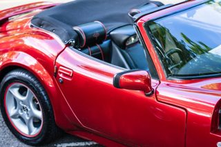 

| Rank | File | Cosine score | Notes |
|:----:|------|:------------:|-------|
| 1 | `6185.jpg` | 0.2867 |  |
| 2 | `6149.jpg` | 0.2832 |  |
| 3 | `3951.jpg` | 0.2819 |  |
| 4 | `6180.jpg` | 0.2815 |  |

